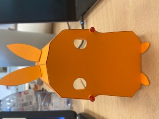

# Pikachu Modelling Guide

### **1. SVG FILE**
An SVG file is needed to print Pikachu in 3D, either from a laser or 3-D machine. For this, first of all, we did a research for the pikachu template on the internet. You can find the Pikachu template we used below.
***

### **2. Inkscape**
As a second step, we converted the template we found to an SVG file using inkscape software to get the output of Pikachu.
***

### **3. Making Pikachu**
Finally, we have the Pikachu below by outputting the SVG file from the laser machine.
***

***

***

***
