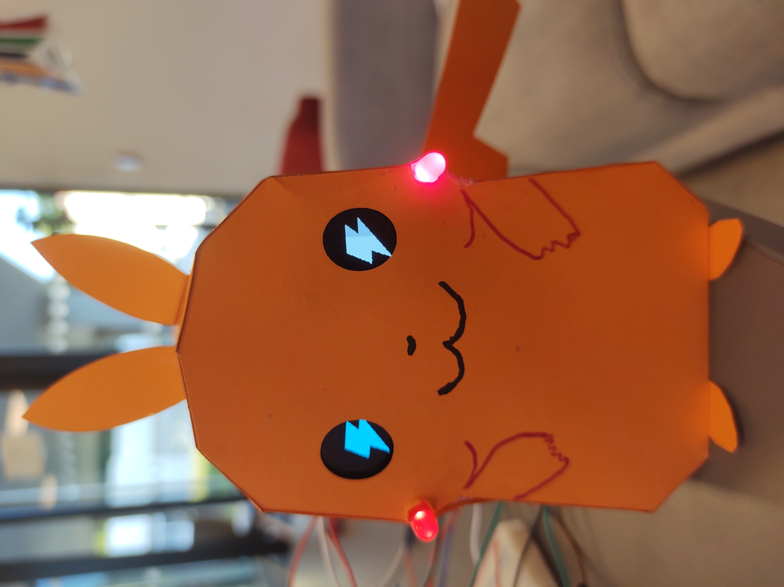
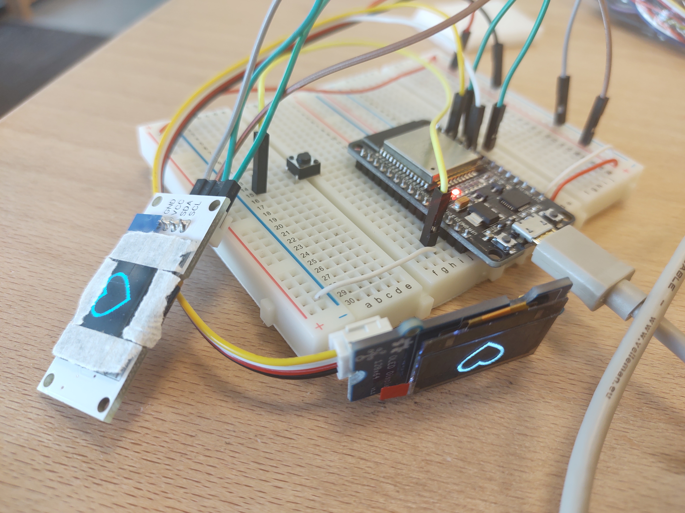
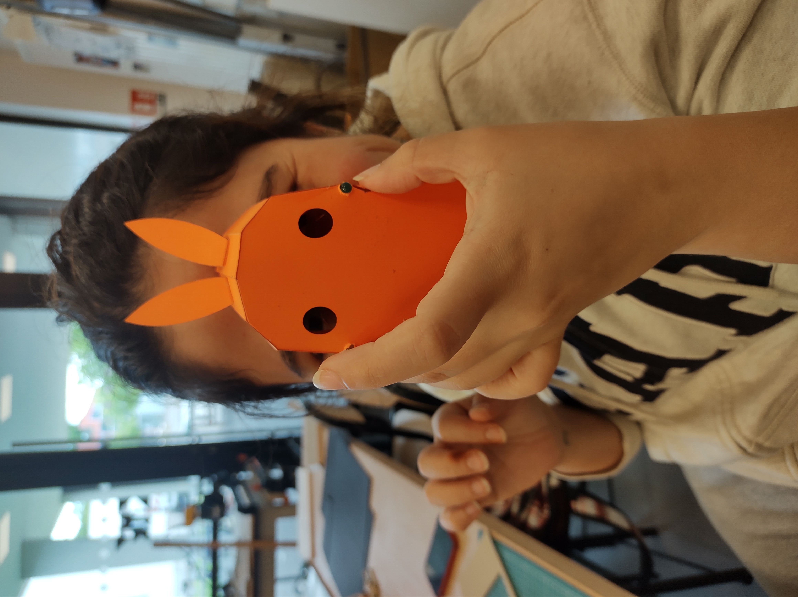
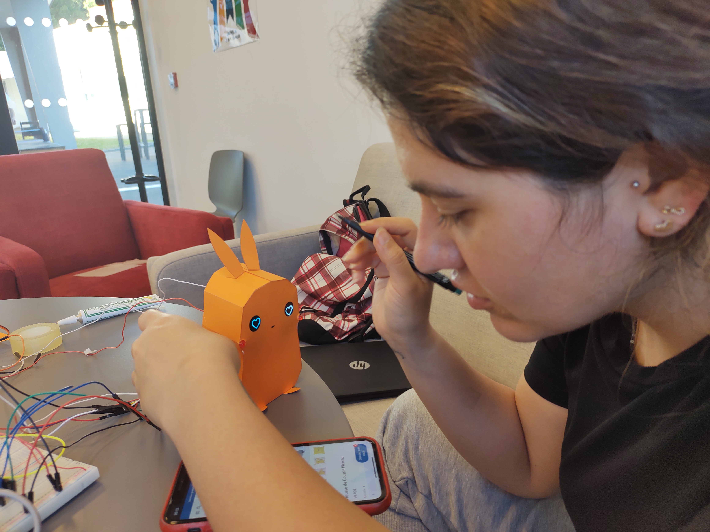
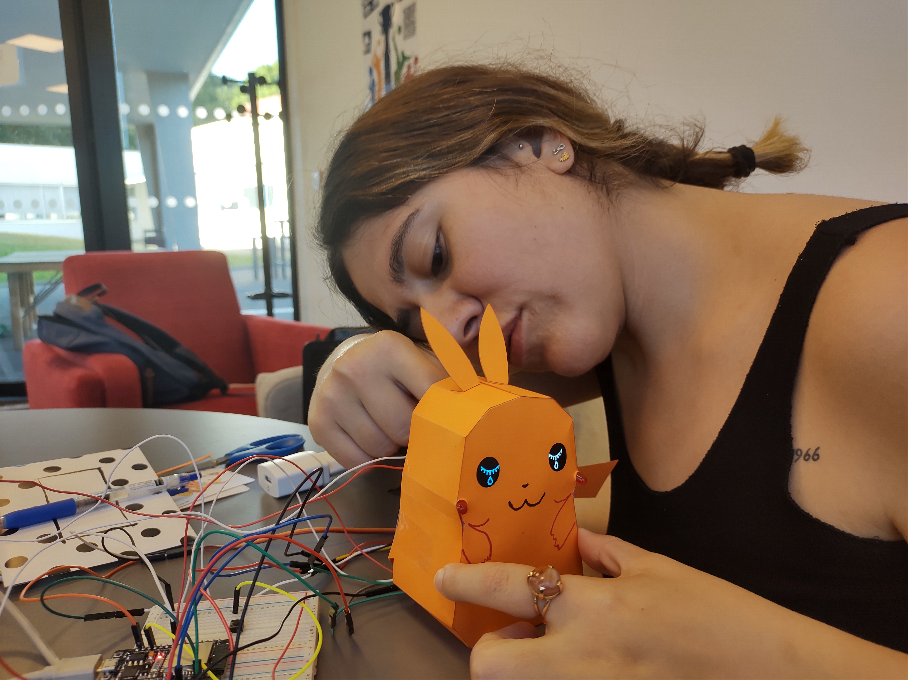

# MicroPython Pikachu

## **Project Description**
This is a small & fun MicroPython project aiming to test the ESP32 board BLE connectivity with an Android phone and the use of custom-made libraries to create 128x64 OLED screen animations. Also tested PWM and digital outputs.

Android app was done with the help of good-old App Inventor tool.

BLE + App Inventor connectivity is not very well documented as of 2022, so hopefully you can find this repo as a good reference for doing that.
***
## **Functional Demo Video**

You can find a demo video clicking in the next image!

***

## **Building Process Pictures**

Some fun pictures of the assembling process!

***
1) Testing the OLEDs

***
2) Inserting cheek LEDs

***
3) Drawing Pikachu's face

***
4) Mounting Pikachu's tail
